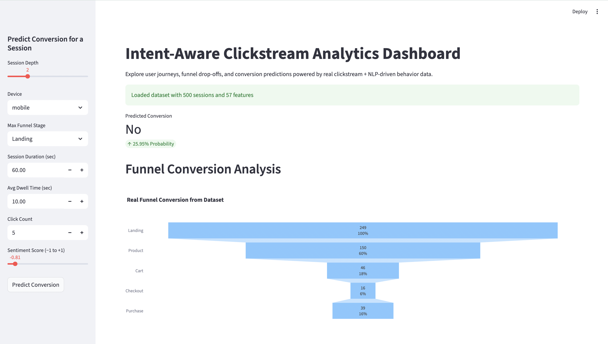
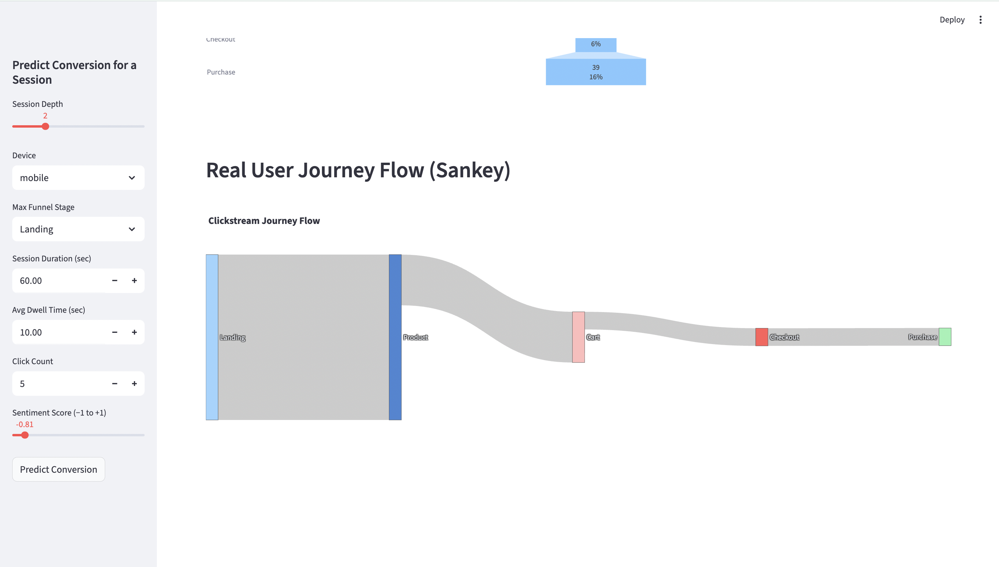

# Intent-Aware Clickstream Analytics

A comprehensive machine learning pipeline for predicting user conversion behavior using clickstream data and natural language processing techniques.

## Project Overview

This project implements an end-to-end analytics system that:
- Processes raw clickstream data and extracts behavioral features
- Applies NLP techniques to analyze search queries and product descriptions
- Trains XGBoost models to predict user conversion probability
- Provides an interactive Streamlit dashboard for real-time predictions

## Quick Start

### 1. Setup Environment

```bash
# Create virtual environment
python3 -m venv venv
source venv/bin/activate  # On Windows: venv\Scripts\activate

# Install dependencies
pip install -r requirements.txt
```

### 2. Run the Pipeline

Execute the modules in sequence to process data and train models:

```bash
# Step 1: Clean text data
python src/data_preprocessing/text_cleaner.py

# Step 2: Extract NLP features
python src/feature_engineering/nlp_features.py

# Step 3: Compute behavioral features
python src/feature_engineering/behavior_features.py

# Step 4: Train the model
python src/modeling/train_model.py
```

### 3. Launch Dashboard

```bash
streamlit run app/main.py
```

## Dashboard Preview

### Main Dashboard

*Interactive dashboard showing conversion prediction interface and funnel analysis*

### User Journey Flow

*Sankey diagram visualizing user journey flow through conversion funnel stages*

## Features

### Data Processing
- **Text Cleaning**: Removes punctuation, stopwords, and lemmatizes search queries
- **NLP Features**: TF-IDF vectorization, sentiment analysis using VADER
- **Behavioral Features**: Session duration, click depth, device type, funnel progression

### Machine Learning
- **XGBoost Model**: Enhanced with class balancing and feature engineering
- **Feature Engineering**: Funnel one-hot encoding, TF-IDF dimensionality reduction
- **Model Evaluation**: Comprehensive metrics including precision, recall, F1-score

### Dashboard
- **Real-time Predictions**: Interactive form to predict conversion probability
- **Funnel Visualization**: Conversion funnel charts using real data
- **User Journey Flow**: Sankey diagrams showing user paths
- **Sentiment Analysis**: Distribution of user sentiment scores

## Key Components

### Text Processing (`src/data_preprocessing/text_cleaner.py`)
- Converts queries to lowercase
- Removes punctuation and special characters
- Filters stopwords using NLTK
- Applies lemmatization for better TF-IDF performance

### NLP Features (`src/feature_engineering/nlp_features.py`)
- **TF-IDF Vectorization**: Converts text to numerical vectors (top 100 words)
- **Sentiment Analysis**: VADER sentiment scoring (-1 to +1)
- **Keyword Extraction**: Simple top-N word extraction
- **Model Persistence**: Saves TF-IDF vectorizer for inference

### Behavioral Features (`src/feature_engineering/behavior_features.py`)
- **Session Metrics**: Click count, average dwell time, session duration
- **Funnel Analysis**: Maximum funnel stage reached per session
- **Device Encoding**: One-hot encoding for mobile/desktop/tablet
- **Feature Aggregation**: Combines behavioral and NLP features

### Model Training (`src/modeling/train_model.py`)
- **Enhanced XGBoost**: Optimized hyperparameters with class balancing
- **Feature Engineering**: Funnel one-hot encoding, TF-IDF SVD reduction
- **Cross-validation**: Proper train/test split with stratification
- **Performance Metrics**: Accuracy, precision, recall, F1-score, confusion matrix

## Model Performance

The enhanced XGBoost model includes:
- **Class Balancing**: Handles imbalanced conversion data
- **Feature Selection**: 20 TF-IDF SVD components for dimensionality reduction
- **Hyperparameter Tuning**: Optimized for conversion prediction
- **Robust Evaluation**: Comprehensive metrics and confusion matrix analysis

## Dashboard Features

### Interactive Prediction
- Adjustable session parameters (depth, device, funnel stage)
- Real-time conversion probability calculation
- Feature importance visualization

### Data Visualization
- **Conversion Funnel**: Real data-driven funnel analysis
- **User Journey**: Sankey diagrams showing user flow patterns
- **Sentiment Distribution**: Pie charts of user sentiment breakdown

## Dependencies

Key Python packages:
- `pandas`, `numpy` - Data manipulation
- `scikit-learn` - Machine learning utilities
- `xgboost` - Gradient boosting model
- `nltk` - Natural language processing
- `streamlit` - Interactive dashboard
- `plotly` - Data visualization

## Usage Examples

### Generate Predictions
```python
from src.modeling.predict import predict_conversion
import pandas as pd

# Example session features
session_data = pd.DataFrame({
    "session_depth": [3],
    "device_desktop": [1],
    "funnel_Product": [1],
    "session_duration": [120],
    # ... other features
})

# Predict conversion
result = predict_conversion(session_data)
print(f"Conversion Probability: {result['Conversion_Prob'].iloc[0]:.3f}")
```

### Clean Text Data
```python
from src.data_preprocessing.text_cleaner import clean_text

# Clean search query
query = "best laptop for gaming 2024"
cleaned = clean_text(query)
print(cleaned)  # "best laptop gaming 2024"
```

## Contributing

1. Fork the repository
2. Create a feature branch
3. Make your changes
4. Test thoroughly
5. Submit a pull request

## License

This project is licensed under the MIT License.

## Related Work

This project demonstrates:
- End-to-end ML pipeline design
- Real-time prediction systems
- Interactive data visualization
- NLP integration with behavioral analytics
- Production-ready model deployment

---

**Built with Python, XGBoost, Streamlit, and NLTK**
